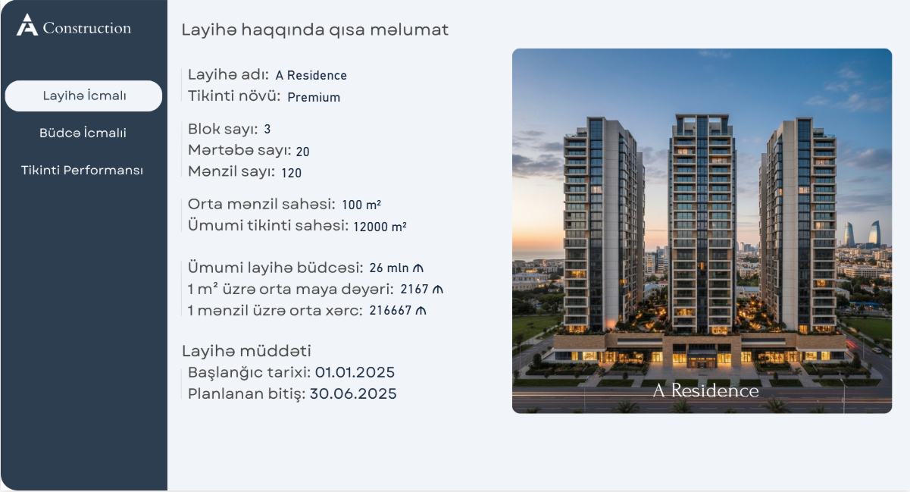
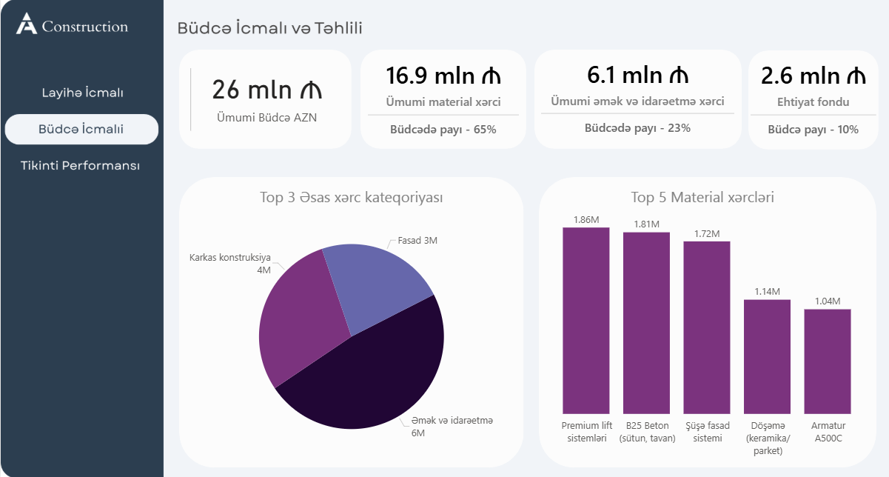
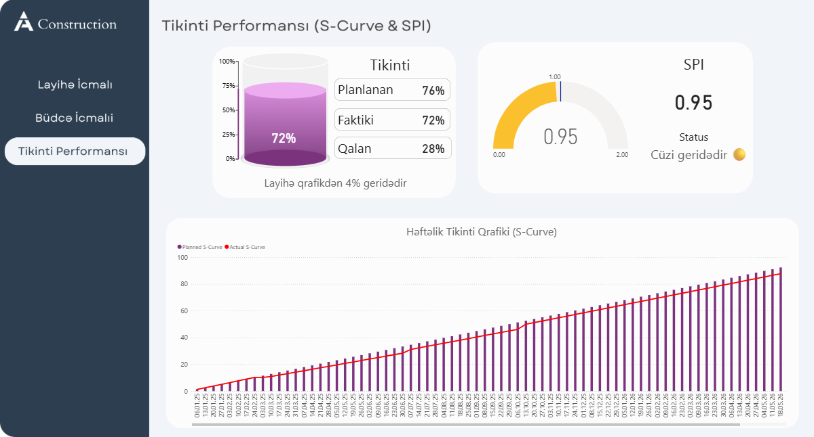

# Construction-Budget-Dashboard-Power-BI-Dashboard

## 🧾 Overview
This **Construction Budget Dashboard** provides a comprehensive overview of project financial performance, including total budget allocation, material costs, labor expenses, and reserve funds. It enables real-time comparison of planned vs. actual progress, helping identify budget variances and performance gaps. The dashboard supports data-driven decision-making for effective cost control and project management.

## 🖼 Dashboard Preview

## 🛠 Tools & Technologies Used
- Power BI   
- Advanced DAX  
- Dynamic Measures & Conditional Formatting  
- Data Modeling  
- UI/UX Dashboard Design  

## 🔗 Live Dashboard
Explore the interactive dashboard here:  
👉 **Link:**  
https://app.powerbi.com/view?r=eyJrIjoiZGE5OTljMWQtNDNjMy00YzhjLWE0NmYtM2VkZDIxZjg5NTY4IiwidCI6ImUwNTNjOTY0LTM3YmMtNDhkYi1hZmQ1LWQ4YjQzODkwZTk4NSIsImMiOjl9

## 👤 Author
**Jamila Agazada**
